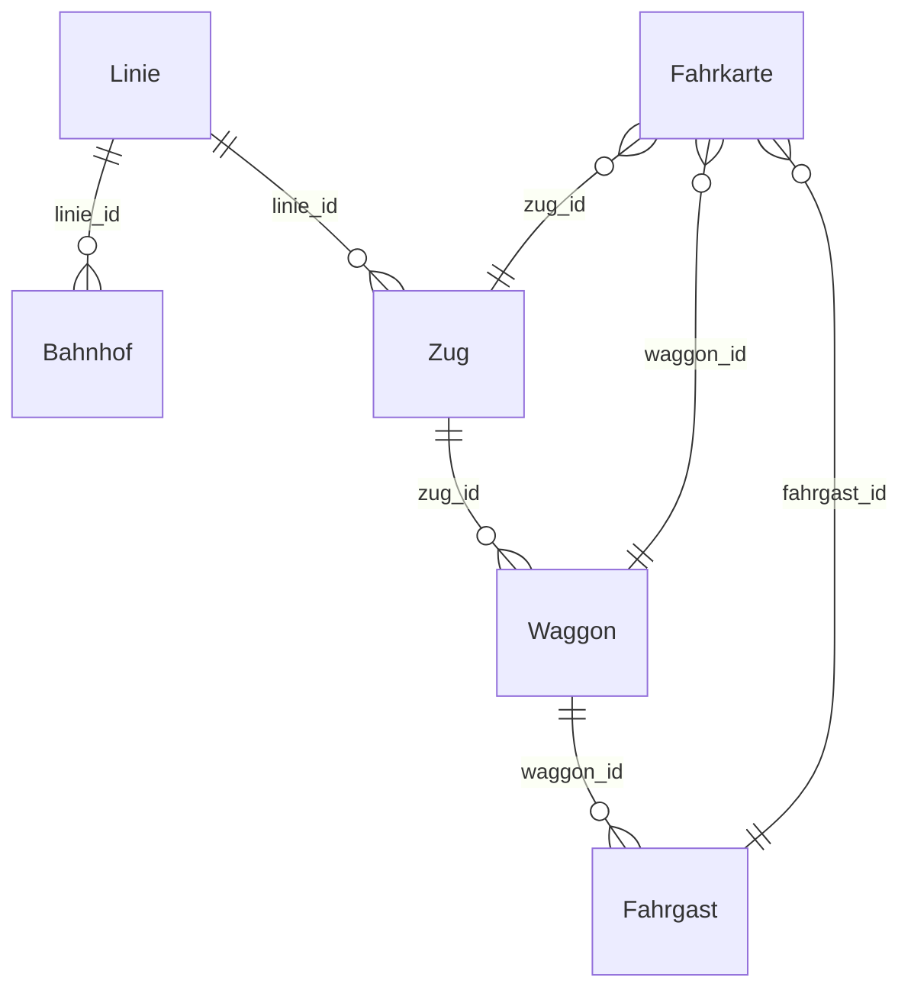

# Zugverwaltung

> Schulprojekt · HTL · Fach INFI

Spring Boot Backend zur Verwaltung von Zügen, Waggons, Linien, Bahnhöfen und Fahrkarten — umgesetzt mit ORMLite und MySQL. Inklusive einer lokalen Web-UI.

---

## Branches

| Branch   | Inhalt                                            |
|----------|---------------------------------------------------|
| `main`   | Pflichtenheft (`Pflichtenheft_Zugverwaltung.pdf`) |
| `master` | Vollständiger Quellcode                           |

---

## Technologien

| Technologie | Verwendung                       | Version |
|-------------|----------------------------------|---------|
| Java        | Programmiersprache               | 21      |
| Spring Boot | REST API Framework               | 3.2.5   |
| ORMLite     | ORM-Schicht                      | 6.1     |
| MySQL       | Relationale Datenbank            | 8.x     |
| Maven       | Build- und Dependency-Management | 3.x     |

---

## Schnellstart

### Voraussetzungen

- Java 21
- MySQL-Server (lokal oder remote)
- Maven 3.x

### 1. Datenbank anlegen

```sql
CREATE DATABASE zugverwaltung;
```

### 2. Konfiguration anpassen

`src/main/resources/application.properties`:

```properties
db.url=jdbc:mysql://localhost:3306/zugverwaltung
db.username=DEIN_BENUTZER
db.password=DEIN_PASSWORT
```

### 3. Starten

```bash
mvn spring-boot:run
```

Alle Tabellen werden beim Start automatisch erstellt (`TableUtils.createTableIfNotExists`).

### 4. Web-UI öffnen

```
http://localhost:8080/index.html
```

Die UI enthält einen **Dev-Tab** (`🛠 Dev`) zum schnellen Befüllen und Zurücksetzen der Datenbank mit Testdaten.

---

## Datenbankmodell



---

## API-Referenz

### Züge — `/api/zuege`

| Methode  | Endpunkt                             | Beschreibung             |
|----------|--------------------------------------|--------------------------|
| `GET`    | `/api/zuege`                         | Alle Züge abrufen        |
| `POST`   | `/api/zuege`                         | Neuen Zug anlegen        |
| `DELETE` | `/api/zuege/{zugId}`                 | Zug löschen              |
| `GET`    | `/api/zuege/waggons`                 | Alle Waggons abrufen     |
| `POST`   | `/api/zuege/waggons/{zugId}`         | Waggon zu Zug hinzufügen |
| `DELETE` | `/api/zuege/waggons/{waggonId}`      | Waggon löschen           |
| `PUT`    | `/api/zuege/{zugId}/linie/{linieId}` | Linie zuweisen           |

### Tickets — `/api/tickets`

| Methode  | Endpunkt                          | Beschreibung                |
|----------|-----------------------------------|-----------------------------|
| `GET`    | `/api/tickets`                    | Alle Fahrkarten abrufen     |
| `POST`   | `/api/tickets/buy`                | Fahrkarte kaufen            |
| `DELETE` | `/api/tickets/{id}`               | Fahrkarte stornieren        |
| `GET`    | `/api/tickets/fahrgaeste`         | Alle Fahrgäste abrufen      |
| `POST`   | `/api/tickets/fahrgaeste`         | Neuen Fahrgast anlegen      |
| `GET`    | `/api/tickets/waggons?zugId={id}` | Waggons eines Zuges abrufen |

### Linien — `/api/linien`

| Methode  | Endpunkt                 | Beschreibung                  |
|----------|--------------------------|-------------------------------|
| `GET`    | `/api/linien`            | Alle Linien abrufen           |
| `GET`    | `/api/linien/{id}`       | Linie nach ID abrufen         |
| `POST`   | `/api/linien`            | Neue Linie anlegen            |
| `DELETE` | `/api/linien/{id}`       | Linie löschen                 |
| `GET`    | `/api/linien/zuege/{id}` | Alle Züge einer Linie abrufen |

### Bahnhöfe — `/api/bhf`

| Methode  | Endpunkt                           | Beschreibung                      |
|----------|------------------------------------|-----------------------------------|
| `GET`    | `/api/bhf`                         | Alle Bahnhöfe abrufen             |
| `GET`    | `/api/bhf/{id}`                    | Bahnhof nach ID abrufen           |
| `POST`   | `/api/bhf`                         | Neuen Bahnhof anlegen             |
| `DELETE` | `/api/bhf/{id}`                    | Bahnhof löschen                   |
| `PUT`    | `/api/bhf/{bhfId}/linie/{linieId}` | Linie zu einem Bahnhof zuweisen   |

### Dev — `/api/dev`

| Methode  | Endpunkt        | Beschreibung                          |
|----------|-----------------|---------------------------------------|
| `POST`   | `/api/dev/seed` | Testdaten anlegen (nur wenn DB leer)  |
| `DELETE` | `/api/dev/reset`| Alle Daten löschen                    |

---

## Projektstruktur

```
src/
└── main/
    └── java/org/example/zugverwaltung/
        ├── config/
        │   └── DatabaseConfig.java             # ORMLite Beans & Tabellenerstellung
        ├── controller/
        │   ├── ZugController.java
        │   ├── TicketController.java
        │   ├── LinieController.java
        │   ├── BahnhofController.java
        │   └── DevController.java              # Testdaten-Endpunkte
        ├── model/
        │   ├── Zug.java
        │   ├── Waggon.java
        │   ├── Fahrgast.java
        │   ├── Fahrkarte.java
        │   ├── Linie.java
        │   ├── Bahnhof.java
        │   └── LocalDateTimePersister.java     # Custom ORMLite Persister für LocalDateTime
        └── service/
            ├── ZugService.java
            ├── FahrkartenService.java
            ├── LinieService.java
            └── BhfService.java
src/
└── main/
    └── resources/
        └── static/
            └── index.html                      # Web-UI
```

---

## Hinweise

**`LocalDateTimePersister`** — Da ORMLite `LocalDateTime` nicht nativ unterstützt, wird der Typ als ISO-String (`2024-01-15T08:00:00`) in der Datenbank gespeichert und beim Lesen automatisch zurückgeparst.

**Kaskadierendes Löschen** — `ZugService.zugLoeschen()` löscht automatisch alle zugehörigen Waggons und Fahrkarten. Die Reihenfolge beim Reset ist daher: Züge → Linien → Bahnhöfe → Fahrgäste.

---

## Pflichtenheft

Im Branch `main` als `Pflichtenheft_Zugverwaltung.pdf` abgelegt.