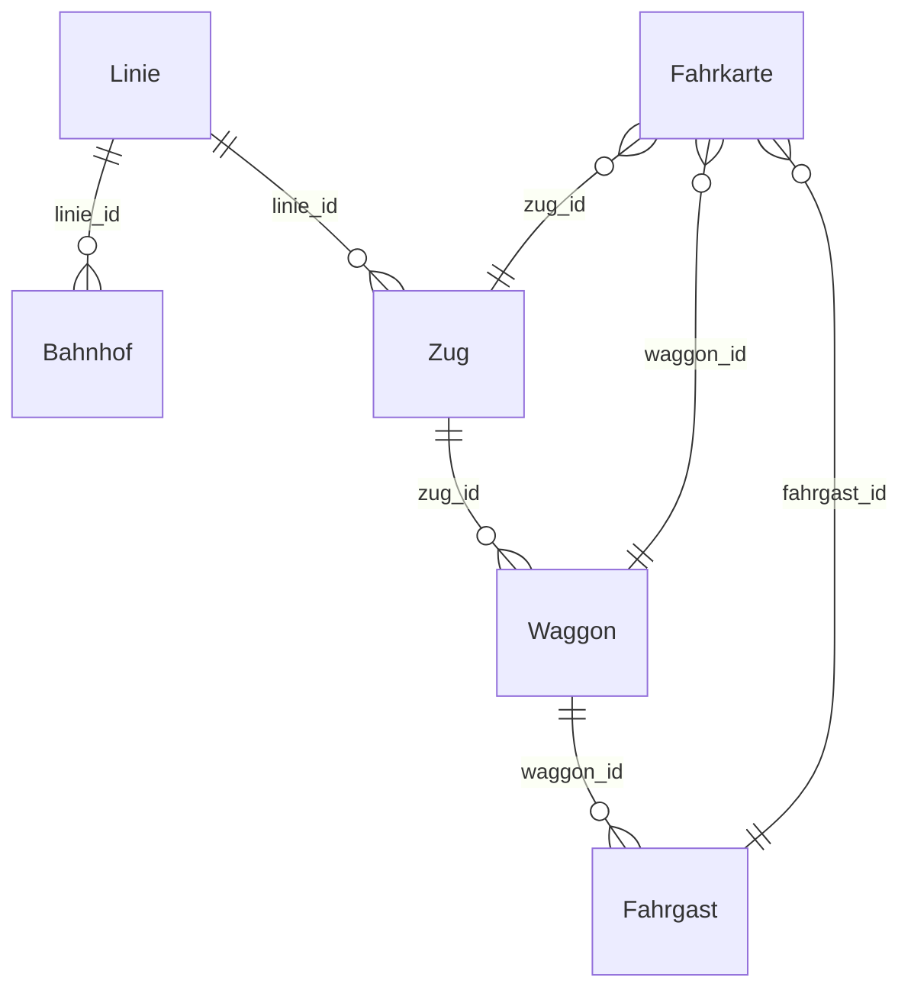

# Zugverwaltung

Schulprojekt | HTL — Fach INFI

Ein Spring Boot Backend-System zur Verwaltung von Zügen, Waggons, Linien, Bahnhöfen und Fahrkarten, umgesetzt mit ORMLite und MySQL.

---

## Repository-Struktur

| Branch   | Inhalt                                            |
|----------|---------------------------------------------------|
| `main`   | Pflichtenheft (`Pflichtenheft_Zugverwaltung.pdf`) |
| `master` | Vollständiger Quellcode des Projekts              |

---

## Technologien

| Technologie | Verwendung                       |
|-------------|----------------------------------|
| Java 17+    | Programmiersprache               |
| Spring Boot | REST API Framework               |
| ORMLite     | ORM-Schicht                      |
| MySQL       | Relationale Datenbank            |
| Maven       | Build- und Dependency-Management |

---

## Datenbankmodell



---

## Setup

### Voraussetzungen

- Java 17 oder höher
- MySQL-Server (lokal oder remote)
- Maven

### 1. Datenbank anlegen

``` sql
CREATE DATABASE zugverwaltung;
```

### 2. Konfiguration anpassen

`src/main/resources/application.properties`:

```properties
db.url=jdbc:mysql://localhost:3306/zugverwaltung
db.username=DEIN_BENUTZER
db.password=DEIN_PASSWORT
```

### 3. Anwendung starten

```bash
  mvn spring-boot:run
```

Alle Tabellen werden beim Start automatisch erstellt (`TableUtils.createTableIfNotExists`).

---

## API-Referenz

### Züge — `/api/zuege`

| Methode  | Endpunkt                        | Beschreibung             |
|----------|---------------------------------|--------------------------|
| `GET`    | `/api/zuege`                    | Alle Züge abrufen        |
| `POST`   | `/api/zuege`                    | Neuen Zug anlegen        |
| `DELETE` | `/api/zuege/{zugId}`            | Zug löschen              |
| `GET`    | `/api/zuege/waggons`            | Alle Waggons abrufen     |
| `POST`   | `/api/zuege/waggons/{zugId}`    | Waggon zu Zug hinzufügen |
| `DELETE` | `/api/zuege/waggons/{waggonId}` | Waggon löschen           |

### Tickets — `/api/tickets`

| Methode | Endpunkt                          | Beschreibung                |
|---------|-----------------------------------|-----------------------------|
| `GET`   | `/api/tickets`                    | Alle Fahrkarten abrufen     |
| `POST`  | `/api/tickets/buy`                | Fahrkarte kaufen            |
| `GET`   | `/api/tickets/fahrgaeste`         | Alle Fahrgäste abrufen      |
| `POST`  | `/api/tickets/fahrgaeste`         | Neuen Fahrgast anlegen      |
| `GET`   | `/api/tickets/waggons?zugId={id}` | Waggons eines Zuges abrufen |

### Linien — `/api/linien`

| Methode   | Endpunkt           | Beschreibung          |
|-----------|--------------------|-----------------------|
| `GET`     | `/api/linien`      | Alle Linien abrufen   |
| `GET`     | `/api/linien/{id}` | Linie nach ID abrufen |
| `POST`    | `/api/linien`      | Neue Linie anlegen    |
| `DELETE`  | `/api/linien/{id}` | Linie löschen         |

### Bahnhöfe — `/api/bhf`

| Methode   | Endpunkt        | Beschreibung            |
|-----------|-----------------|-------------------------|
| `GET`     | `/api/bhf`      | Alle Bahnhöfe abrufen   |
| `GET`     | `/api/bhf/{id}` | Bahnhof nach ID abrufen |
| `POST`    | `/api/bhf`      | Neuen Bahnhof anlegen   |
| `DELETE`  | `/api/bhf/{id}` | Bahnhof löschen         |

---

## Projektstruktur

```
src/
└── main/
    └── java/org/example/zugverwaltung/
        ├── config/
        │   └── DatabaseConfig.java            # ORMLite Beans & Tabellenerstellung
        ├── controller/
        │   ├── ZugController.java
        │   ├── TicketController.java
        │   ├── LinieController.java
        │   └── BahnhofController.java
        ├── model/
        │   ├── Zug.java
        │   ├── Waggon.java
        │   ├── Fahrgast.java
        │   ├── Fahrkarte.java
        │   ├── Linie.java
        │   ├── Bahnhof.java
        │   └── LocalDateTimePersister.java    # Custom ORMLite Persister für LocalDateTime
        └── service/
            ├── ZugService.java
            ├── FahrkartenService.java
            ├── LinieService.java
            └── BhfService.java
```

---

## Pflichtenheft

Das Pflichtenheft ist im Branch `main` als `Pflichtenheft_Zugverwaltung.pdf` abgelegt.